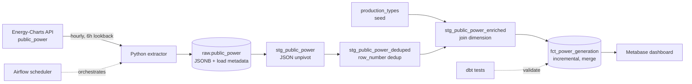

# EU Power Pipeline


End-to-end data pipeline for European electricity generation: scheduled ingestion from a public API, warehouse modelling with dbt, data quality tests and a dashboard. Runs locally via docker-compose.

## Dashboard


## Architecture



## Stack

- **Ingestion:** Python, requests
- **Orchestration:** Airflow 3.3 (LocalExecutor)
- **Warehouse:** PostgreSQL 16
- **Transformations:** dbt 1.12
- **BI:** Metabase
- **CI:** GitHub Actions (ruff, dbt build)
- **Infrastructure:** docker-compose

## Running locally

Requires Docker and Docker Compose.

```bash
cp .env.example .env          # adjust credentials if needed
docker compose up -d          # Postgres, Airflow, Metabase
docker compose exec -T postgres psql -U power -d power < init.sql
```

Airflow UI: http://localhost:8081 (admin / admin)
Metabase: http://localhost:3000

To run transformations:

```bash
cd dbt_power
export $(grep -v '^#' ../.env | xargs)
dbt deps --profiles-dir .
dbt seed --profiles-dir .
dbt build --profiles-dir .
```

The ingestion DAG `public_power_ingestion` runs hourly and loads a rolling
six-hour window for Germany and France.


## Source behaviour and how the pipeline handles it

The Energy-Charts API has several properties that shaped the design.
All of them were established by querying the live API, not from documentation.

| Observation | Consequence in the pipeline |
|---|---|
| Columnar response: timestamps and values linked by array position only | Unpivot in the staging layer using `jsonb_array_elements` with `WITH ORDINALITY` |
| Requested interval is inclusive on both ends | Overlapping loads produce duplicates; resolved by deduplication on a composite key |
| Responses are silently truncated at the publication boundary | A day-completeness test flags days with fewer than 96 points |
| `null` means "not yet published", not zero | Explicit `jsonb_typeof` check; deduplication prefers non-null values |
| Published values are revised retroactively, on a scale of days | Merge-based incremental load with a seven-day window |
| The set of indicators varies by country and over time | Long-format fact table; a `relationships` test fails on unknown indicators |

Full details in [ADR-0001](docs/adr/0001-data-source-selection.md).

## Known limitations

- CI builds the dbt project against an empty database, so tests validate
  structure rather than data. Adding fixture seeds would address this.
- The seven-day revision window is based on a single observed comparison;
  a longer study would give a better figure.
- Metabase questions live inside the container and are not versioned;
  the underlying SQL is in `analytics/`.
- The energy balance does not close: generation plus imports falls short
  of reported load by roughly 2.7 GW for Germany. Cause not investigated.
- Waste is treated as 50% renewable to match the source methodology.
  This is a simplification.