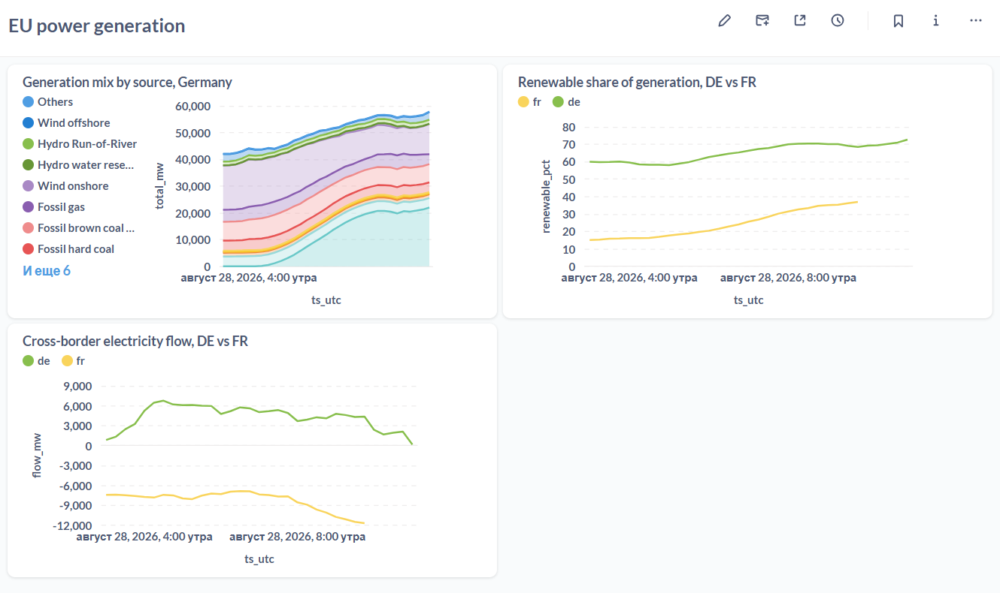
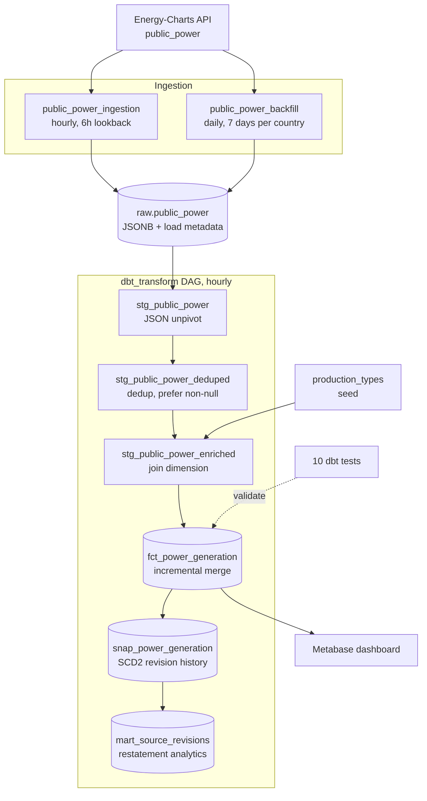
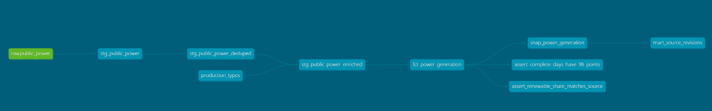

# EU Power Pipeline


End-to-end data pipeline for European electricity generation: scheduled ingestion from a public API, warehouse modelling with dbt, data quality tests and a dashboard. Runs locally via docker-compose.

## Dashboard



## Architecture



### Model lineage



Generated with `dbt docs generate`.

## Stack

- **Ingestion:** Python, requests
- **Orchestration:** Airflow 3.3 (LocalExecutor)
- **Warehouse:** PostgreSQL 16
- **Transformations:** dbt 1.12
- **BI:** Metabase
- **CI:** GitHub Actions (ruff, dbt build)
- **Infrastructure:** docker-compose

## Running locally

Requires Docker and Docker Compose.

```bash
cp .env.example .env          # adjust credentials if needed
docker compose up -d          # Postgres, Airflow, Metabase
docker compose exec -T postgres psql -U power -d power < init.sql
```

Airflow UI: http://localhost:8081 (admin / admin)
Metabase: http://localhost:3000

To run transformations:

```bash
cd dbt_power
export $(grep -v '^#' ../.env | xargs)
dbt deps --profiles-dir .
dbt seed --profiles-dir .
dbt build --profiles-dir .
```

The ingestion DAG `public_power_ingestion` runs hourly and loads a rolling
six-hour window for Germany and France.


## Source behaviour and how the pipeline handles it

The Energy-Charts API has several properties that shaped the design.
All of them were established by querying the live API, not from documentation.

| Observation | Consequence in the pipeline |
|---|---|
| Columnar response: timestamps and values linked by array position only | Unpivot in the staging layer using `jsonb_array_elements` with `WITH ORDINALITY` |
| Requested interval is inclusive on both ends | Overlapping loads produce duplicates; resolved by deduplication on a composite key |
| Responses are silently truncated at the publication boundary | A day-completeness test flags days with fewer than 96 points |
| `null` means "not yet published", not zero | Explicit `jsonb_typeof` check; deduplication prefers non-null values |
| Published values are revised retroactively, on a scale of days | Merge-based incremental load with a seven-day window |
| The set of indicators varies by country and over time | Long-format fact table; a `relationships` test fails on unknown indicators |
| The API rate-limits concurrent requests | Backfill concurrency capped at 2 tasks; HTTP 429 triggers a `Retry-After` pause before failing into Airflow's retry mechanism |
| HTTP 404 is returned when the requested window starts beyond the published range — not when data is merely sparse | Treated as "no data yet" rather than an error, but consecutive empty loads are counted and the task fails after six |
| Publication delay differs by country: Germany lags a few hours, France has been observed lagging over a day | A single hourly window cannot cover both, so a separate daily backfill reloads seven days per country |

Full details in [ADR-0001](docs/adr/0001-data-source-selection.md).

## Measuring source revisions

The source restates already-published values days after the fact. The pipeline
applies those corrections, which means the fact table always holds the latest
version and the revisions themselves would be invisible.

A dbt snapshot keeps every version the API has returned, using SCD Type 2:

| ts_utc | production_type | value | dbt_valid_from | dbt_valid_to |
|---|---|---|---|---|
| 04:00 | Load | 40274.8 | 19 Aug | 27 Aug |
| 04:00 | Load | 40270.4 | 27 Aug | null |

`mart_source_revisions` builds on it to answer questions the fact table cannot:
how often values are restated, how large the corrections are, and how long after
measurement they keep arriving.

The revision behaviour was found by capturing the same request twice, eight days
apart, and diffing the results: the array grew from 34 to 96 points and
previously published values shifted by around 0.01%. Derived percentages moved
more — `Renewable share of generation` went from 50.8 to 49.4. Both snapshots
are in `docs/samples/`.

## Known limitations

- CI builds the dbt project against an empty database, so tests validate
  structure rather than data. Adding fixture seeds would address this.
- The oldest day in the backfill window loads only partially, so the
  completeness test checks days between two and seven days old.
- dbt runs inside the Airflow image rather than a separate container.
  A dedicated container would isolate the two better but needs
  Docker-in-Docker.
- The Airflow JWT secret is hardcoded in `docker-compose.yml` for local
  development. In any shared environment it must come from a secret store.
- Metabase questions live inside the container and are not versioned;
  the underlying SQL is in `analytics/`.
- The energy balance does not close: generation plus imports falls short
  of reported load by roughly 2.7 GW for Germany. Cause not investigated.
- Waste is treated as 50% renewable to match the source methodology.
  This is a simplification.