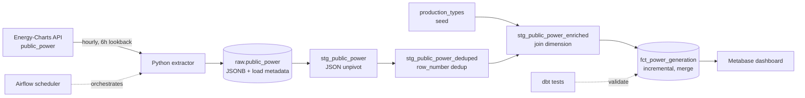

# EU Power Pipeline

End-to-end data pipeline for European electricity generation: scheduled ingestion from a public API, warehouse modelling with dbt, data quality tests and a dashboard. Runs locally via docker-compose.

## Dashboard

## Architecture

## Stack

- **Ingestion:** Python, requests
- **Orchestration:** Airflow 3.3 (LocalExecutor)
- **Warehouse:** PostgreSQL 16
- **Transformations:** dbt 1.12
- **BI:** Metabase
- **CI:** GitHub Actions (ruff, dbt build)
- **Infrastructure:** docker-compose